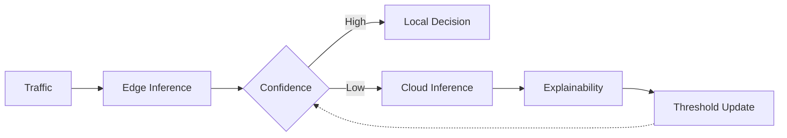
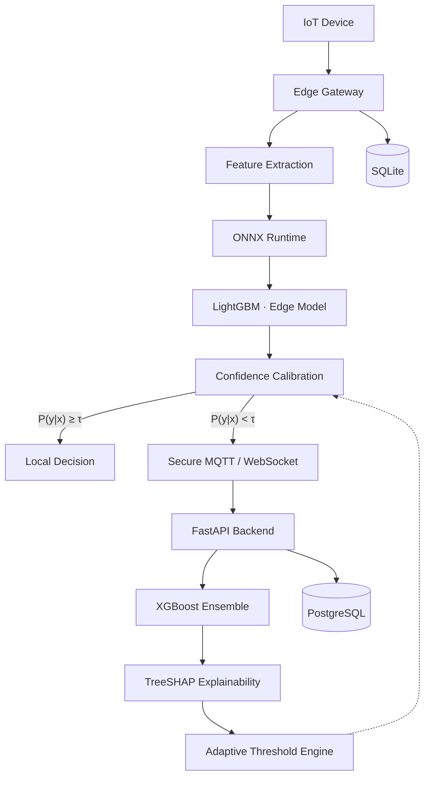
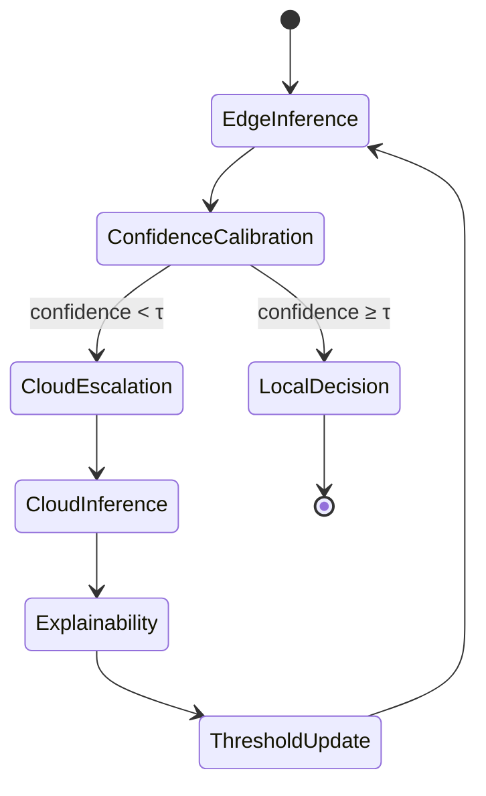
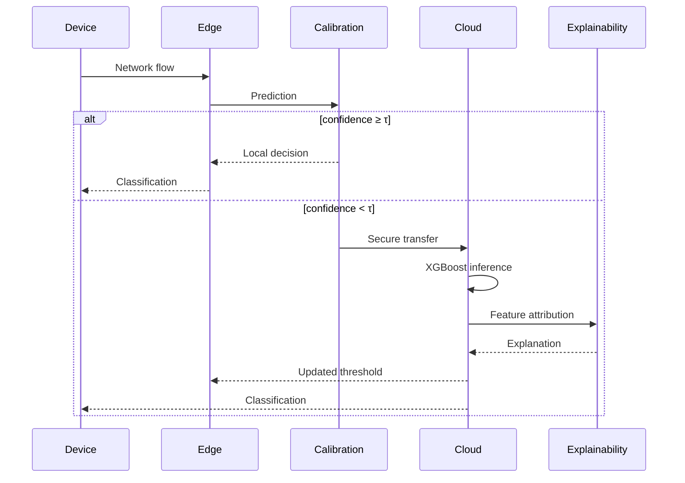
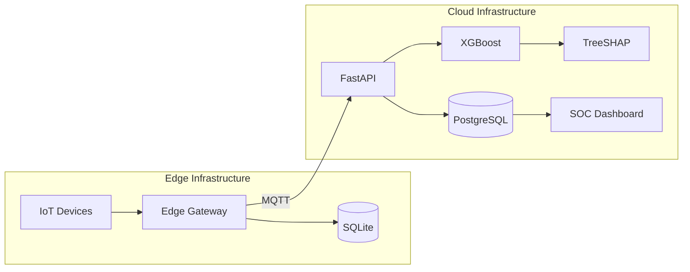
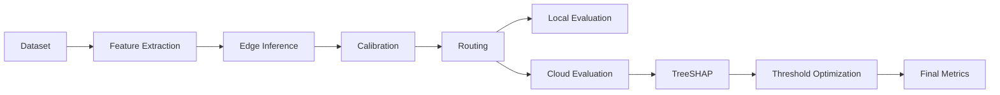

<div align="center">


<br/><br/>


<br/><br/>

# AECIDS

**Adaptive Explainable Edge–Cloud Intrusion Detection System**

Confidence-calibrated intelligent routing for resource-constrained IoT networks.

<br/>

<sub>Research Project · Engineering Design &amp; Innovation (EDI) · Smart Kopargaon Hackathon · 2026–27</sub>

<br/><br/>


<br/>

**[Overview](#overview)** &nbsp;·&nbsp;
**[Architecture](#architecture)** &nbsp;·&nbsp;
**[Principles](#engineering-principles)** &nbsp;·&nbsp;
**[Methodology](#research-methodology)** &nbsp;·&nbsp;
**[Installation](#installation)** &nbsp;·&nbsp;
**[API](#api-reference)** &nbsp;·&nbsp;
**[Roadmap](#roadmap)**

</div>

<br/>

---

<br/>

## Overview

AECIDS is a research-driven hybrid intrusion detection framework built for resource-constrained IoT environments.

It combines lightweight edge inference, confidence-calibrated routing, cloud-assisted deep analysis, and explainable machine learning into a single cooperative architecture — rather than treating edge and cloud as isolated systems, AECIDS lets them adapt to uncertainty together, in real time.

<br/>

### Status

> [!IMPORTANT]
> This repository is under active engineering development. Backend, edge runtime, and dashboard are being implemented in parallel; experimental validation follows hardware integration.

<table>
<tr><td width="60%">

**Complete**
Literature survey · System architecture · Research methodology · Software design specification

**In progress**
Backend services · Edge runtime · SOC dashboard

**Pending**
Experimental evaluation · Hardware validation

</td><td width="40%">

```text
Research           ████████████████████ 100%
Architecture        ████████████████████ 100%
Methodology         ████████████████████ 100%
Design Spec         ████████████████████ 100%
Backend             ████████████░░░░░░░░  60%
Edge Runtime        █████████░░░░░░░░░░░  45%
SOC Dashboard       ██████████░░░░░░░░░░  50%
Evaluation          ░░░░░░░░░░░░░░░░░░░░   0%
```

</td></tr>
</table>

<br/>

### Team

<table>
<tr>
<td width="25%" align="center"><b>Atharva Vavhal</b><br/><sub>Team Leader</sub></td>
<td width="25%" align="center"><b>Vedika Mehta</b><br/><sub>Team Member</sub></td>
<td width="25%" align="center"><b>Swapnil Pawar</b><br/><sub>Team Member</sub></td>
<td width="25%" align="center"><b>Janhavi Waychal</b><br/><sub>Team Member</sub></td>
</tr>
</table>

<sub>**Institution** Vishwakarma Institute of Technology, Pune &nbsp;·&nbsp; **Department** Computer Engineering (Software Engineering) &nbsp;·&nbsp; **Course** Engineering Design &amp; Innovation &nbsp;·&nbsp; **Year** 2026–27</sub>

<br/>

---

<br/>

## Problem Statement

Intrusion detection systems today are forced into one of two compromises.

<table>
<tr>
<td width="50%" valign="top">

**Edge-only**

Extremely low latency, but constrained by memory, compute, and model complexity — weak against sophisticated, polymorphic, or previously unseen attacks.

</td>
<td width="50%" valign="top">

**Cloud-only**

Far greater analytical capacity, but every flow must cross the network first — adding latency, WAN load, infrastructure cost, and a dependency on connectivity.

</td>
</tr>
</table>

**The engineering challenge** is a system that delivers low edge latency, efficient cloud utilization, adaptive decision-making, explainable predictions, and deployability on constrained IoT gateways — simultaneously, not as a trade-off.

<br/>

---

<br/>

## Solution Overview

AECIDS introduces a hierarchical Edge–Cloud inference pipeline governed by confidence-calibrated routing. Every flow is first analyzed locally by a lightweight model. Its calibrated confidence score decides whether the prediction is trustworthy enough to act on immediately, or uncertain enough to escalate for deeper cloud analysis.

Only uncertain traffic ever leaves the device — bandwidth and cloud cost scale with genuine ambiguity, not with total traffic volume.

<br/>

<table>
<tr><td width="25%"><b>Edge Intelligence</b></td><td>Real-time lightweight intrusion detection</td></tr>
<tr><td><b>Confidence Calibration</b></td><td>Reliability estimation of every edge prediction</td></tr>
<tr><td><b>Cloud Intelligence</b></td><td>High-capacity secondary inference for uncertain flows</td></tr>
<tr><td><b>Explainable Adaptation</b></td><td>Dynamic optimization of the routing threshold</td></tr>
</table>



<br/>

---

<br/>

## Research Objectives

<table>
<tr><td width="30%"><b>Edge efficiency</b></td><td>Low-latency detection on ARM64 gateways using lightweight models</td></tr>
<tr><td><b>Confidence-aware routing</b></td><td>Escalate to cloud only when calibrated confidence is insufficient</td></tr>
<tr><td><b>Explainable security</b></td><td>Interpretable predictions via exact TreeSHAP attribution</td></tr>
<tr><td><b>Adaptive intelligence</b></td><td>Routing behavior improves continuously through explanation-driven feedback</td></tr>
<tr><td><b>Operational resilience</b></td><td>Reliable operation through intermittent cloud connectivity</td></tr>
</table>

<br/>

### Novel Contributions

Unlike conventional IDS pipelines that statically partition work between edge and cloud, AECIDS closes the loop — explainability output directly shapes future routing decisions.

| Contribution | What it does |
|---|---|
| Confidence-Calibrated Routing | Routes each flow based on calibrated posterior confidence, not raw probability |
| Explainable Adaptation Engine | TreeSHAP attributions continuously retune the routing threshold |
| Hybrid Inference Architecture | Lightweight edge model paired with a high-capacity cloud ensemble |
| Edge-Oriented Deployment | Purpose-built for Raspberry Pi and industrial ARM64 gateways |
| Explainability Feedback Loop | Feature-attribution drift becomes an optimization signal, not just a report |

<br/>

---

<br/>

## Architecture

The system is organized into four cooperative layers, each with a single, strictly-scoped responsibility.



<br/>

### Routing state machine



<br/>

### Request sequence



<br/>

### Deployment topology



<br/>

### Core components

<table>
<tr><td width="22%"><b>Edge Intelligence</b></td><td>

ONNX-quantized LightGBM on ARM64 hardware. Target latency **&lt; 2 ms**, memory budget **&lt; 45 MB**, persisted locally through SQLite.

</td></tr>
<tr><td><b>Confidence Calibration</b></td><td>

Post-hoc calibration — Temperature Scaling and Platt Scaling — converts raw model output into a reliable posterior before any routing decision is made.

</td></tr>
<tr><td><b>Cloud Intelligence</b></td><td>

FastAPI-fronted XGBoost ensemble handles the flows the edge model is uncertain about, communicating over MQTT/WebSocket and persisting to PostgreSQL.

</td></tr>
<tr><td><b>Explainable Adaptation</b></td><td>

Every cloud prediction produces exact TreeSHAP attributions. These aren't just displayed — feature-importance drift feeds directly back into the routing threshold controller, closing the loop.

</td></tr>
</table>

<br/>

---

<br/>

## Engineering Principles

AECIDS is built on five non-negotiable architectural principles.

<table>
<tr><td width="26%"><b>Edge First</b></td><td>Every packet is evaluated locally before any cloud escalation is considered.</td></tr>
<tr><td><b>Confidence Before Complexity</b></td><td>Cloud inference triggers only when calibrated confidence falls below the adaptive threshold.</td></tr>
<tr><td><b>Explain Every Decision</b></td><td>Every cloud prediction carries an exact TreeSHAP feature attribution.</td></tr>
<tr><td><b>Adaptive Intelligence</b></td><td>Explainability output continuously improves routing behavior through closed-loop optimization.</td></tr>
<tr><td><b>Offline Resilience</b></td><td>Edge gateways keep operating through intermittent or total cloud outages via local inference and SQLite persistence.</td></tr>
</table>

> [!NOTE]
> Explainability is treated as an active optimization signal — not a passive visualization layer.

<br/>

<details>
<summary><b>Architectural invariants</b></summary>
<br/>

- Every network flow is evaluated at the edge before cloud escalation
- Routing decisions depend exclusively on calibrated confidence
- Cloud inference is asynchronous
- TreeSHAP explanations accompany every cloud prediction
- Threshold optimization never bypasses confidence calibration
- SQLite guarantees offline persistence at the edge
- PostgreSQL serves as the centralized analytical data store
- Edge–cloud communication is encrypted end-to-end

</details>

<br/>

---

<br/>

## Research Methodology

Every flow moves through four sequential stages — computational cost scales with uncertainty, not with traffic volume.

```text
1  Edge Inference             lightweight local prediction
2  Confidence Calibration     reliability estimate of that prediction
3  Cloud Escalation           deep inference for low-confidence flows only
4  Explainable Feedback       TreeSHAP output retunes the routing threshold
```

<br/>

### Mathematical formulation

**Temperature scaling** — calibrates raw logits `z = (z₁, …, z_K)` into a reliable posterior:

$$P_i = \frac{\exp(z_i / T)}{\sum_{j=1}^{K} \exp(z_j / T)}$$

where `T > 0` is the learned temperature and `K` is the number of classes.

**Adaptive routing function** — decides where each flow is handled:

$$Route(x) = \begin{cases} \text{Edge}, & P(y \mid x) \ge \tau \\ \text{Cloud}, & P(y \mid x) < \tau \end{cases}$$

**Threshold optimization** — the threshold itself is not static:

$$\tau = f(\Delta SHAP)$$

where `ΔSHAP` is the observed feature-attribution drift over time.

**TreeSHAP** — for every cloud prediction:

$$f(x) = \phi_0 + \sum_{i=1}^{M} \phi_i$$

where `φ₀` is the expected prediction and `φᵢ` is feature `i`'s contribution.

<br/>

---

<br/>

## Technology Stack

AECIDS separates infrastructure into independent layers to simplify deployment, scaling, and maintenance.

<table>
<tr><td width="20%" valign="top"><b>Machine Learning</b></td><td valign="top">

LightGBM (edge) · XGBoost (cloud) · TreeSHAP (explainability) · ONNX Runtime (embedded execution)

</td></tr>
<tr><td valign="top"><b>Backend</b></td><td valign="top">

FastAPI · Python 3.11 · Uvicorn · Pydantic · REST + WebSocket · MQTT

</td></tr>
<tr><td valign="top"><b>Frontend</b></td><td valign="top">

React 18 · TypeScript · TailwindCSS · Recharts · Lucide

</td></tr>
<tr><td valign="top"><b>Storage</b></td><td valign="top">

SQLite (edge queue) · PostgreSQL 16+ (security data lake)

</td></tr>
<tr><td valign="top"><b>Infrastructure</b></td><td valign="top">

Docker · Docker Compose · Raspberry Pi (ARM64) · Industrial Edge Gateway

</td></tr>
</table>

<br/>

### Engineering decisions

| Decision | Rationale |
|---|---|
| Edge-first inference | Minimize latency and bandwidth consumption |
| Confidence-calibrated routing | Avoid unnecessary cloud inference |
| ONNX Runtime | Portable inference across embedded hardware |
| SQLite at the edge | Offline persistence without operational overhead |
| PostgreSQL in the cloud | Scalable analytical storage |
| FastAPI | High-performance asynchronous API layer |
| TreeSHAP | Exact explainability for tree-based ensembles |

<br/>

---

<br/>

## Repository Structure

```text
AECIDS
├── backend/            FastAPI services — routers, calibration, explainability, database
├── edge-agent/          Edge runtime — inference, calibration, MQTT, local storage
├── frontend/            React + TypeScript SOC dashboard
├── models/              Trained LightGBM / XGBoost artifacts
├── datasets/            Training, validation, and test data
├── docs/                Architecture notes, diagrams, research material
├── docker/              Container definitions
├── tests/                Test suites
├── scripts/             Utility and automation scripts
├── docker-compose.yml
├── requirements.txt
└── README.md
```

<table>
<tr><td width="18%"><code>backend/</code></td><td>Asynchronous FastAPI services: API routers, confidence calibration, TreeSHAP explainability, and the PostgreSQL data layer.</td></tr>
<tr><td><code>edge-agent/</code></td><td>The ARM64 runtime — ONNX inference, calibration, MQTT client, SQLite-backed offline queue, and local monitoring.</td></tr>
<tr><td><code>frontend/</code></td><td>The SOC dashboard — components, pages, hooks, and services for the React/TypeScript UI.</td></tr>
<tr><td><code>models/</code></td><td>Serialized edge and cloud model artifacts.</td></tr>
<tr><td><code>datasets/</code></td><td>Data used for training and evaluation.</td></tr>
<tr><td><code>docs/</code></td><td>Architecture references, research notes, and image assets.</td></tr>
</table>

<br/>

---

<br/>

## Installation

<br/>

### Requirements

| Software | Version |
|---|---|
| Python | 3.11+ |
| Node.js | 20+ |
| Docker &amp; Docker Compose | Latest |
| PostgreSQL | 16+ |

<br/>

### Quick start

```bash
git clone https://github.com/<username>/AECIDS.git
cd AECIDS
docker compose up --build
```

<br/>

### Run components individually

**Backend**

```bash
cd backend
python -m venv .venv
source .venv/bin/activate
pip install -r requirements.txt
uvicorn app.main:app --reload
```

**Frontend**

```bash
cd frontend
npm install
npm run dev
```

**Edge runtime**

```bash
cd edge-agent
python main.py
```

<br/>

### Configuration

The application is configured entirely through environment variables.

| Variable | Description |
|---|---|
| `DATABASE_URL` | PostgreSQL connection string |
| `SQLITE_PATH` | Edge database path |
| `MQTT_HOST` | MQTT broker host |
| `MQTT_PORT` | MQTT broker port |
| `SECRET_KEY` | Application secret |
| `MODEL_PATH` | ONNX model location |
| `THRESHOLD` | Initial routing threshold |

<br/>

---

<br/>

## API Reference

> [!NOTE]
> The REST API follows the OpenAPI specification and is fully documented through FastAPI's autogenerated interactive docs.

<br/>

### REST

| Method | Endpoint | Description |
|---|---|---|
| `GET` | `/health` | Service health |
| `POST` | `/predict` | Edge prediction |
| `POST` | `/cloud/predict` | Cloud inference |
| `GET` | `/metrics` | Runtime metrics |
| `GET` | `/threshold` | Current routing threshold |
| `POST` | `/threshold` | Update routing threshold |

<br/>

### WebSocket

| Endpoint | Description |
|---|---|
| `/ws/events` | Live security events |
| `/ws/alerts` | Alert streaming |
| `/ws/status` | Gateway health |
| `/ws/logs` | Runtime logs |

<br/>

---

<br/>

## Security Operations Center

The SOC dashboard centralizes monitoring of edge gateways, cloud inference, routing behavior, and explainability results — designed for operational clarity over visual complexity.

<table>
<tr><td width="22%"><b>Overview</b></td><td>High-level system health and traffic summary</td></tr>
<tr><td><b>Threat Feed</b></td><td>Real-time intrusion events</td></tr>
<tr><td><b>Edge Gateways</b></td><td>Connected gateway monitoring</td></tr>
<tr><td><b>Cloud Analytics</b></td><td>Secondary inference statistics</td></tr>
<tr><td><b>Explainability</b></td><td>TreeSHAP feature attribution</td></tr>
<tr><td><b>Threshold Monitor</b></td><td>Adaptive routing visualization</td></tr>
<tr><td><b>Audit Logs</b></td><td>Historical event timeline</td></tr>
</table>

<br/>

<div align="center">

<sub>Dashboard previews — populated as the SOC UI is completed</sub>

<br/><br/>

<table>
<tr>
<td align="center" width="33%"><sub><code>docs/images/soc-dashboard.png</code></sub><br/><sub>SOC Overview</sub></td>
<td align="center" width="33%"><sub><code>docs/images/threat-feed.png</code></sub><br/><sub>Live Threat Feed</sub></td>
<td align="center" width="33%"><sub><code>docs/images/shap-dashboard.png</code></sub><br/><sub>Explainability View</sub></td>
</tr>
</table>

</div>

<br/>

---

<br/>

## Datasets &amp; Evaluation

> [!NOTE]
> Quantitative benchmark results will be published only after experimental validation. No empirical values are reported until they are reproducible.

<br/>

### Evaluation objectives

| Objective | Description |
|---|---|
| Edge performance | Latency and memory utilization of the embedded inference engine |
| Cloud performance | Inference throughput and request scalability |
| Routing efficiency | Share of flows resolved locally vs. escalated to the cloud |
| Calibration quality | Reliability of confidence estimates after post-hoc calibration |
| Explainability | Consistency and usefulness of TreeSHAP attributions |
| Adaptation | Threshold evolution under changing traffic distributions |

<br/>



<br/>

### Benchmark categories

| Category | Metrics |
|---|---|
| Classification | Accuracy, Precision, Recall, F1, ROC-AUC |
| Edge runtime | Latency, memory usage, CPU utilization |
| Cloud runtime | Throughput, response time |
| Communication | Escalation rate, network overhead |
| Explainability | SHAP stability, feature drift |
| Adaptation | Threshold stability, routing efficiency |

<sub>All experiments — edge and cloud benchmarking, hardware validation, routing and explainability analysis, comparative study — are currently **planned**, pending hardware-in-the-loop evaluation.</sub>

<br/>

---

<br/>

## Design Constraints

The project is deliberately shaped by practical deployment limits.

| Constraint | Response |
|---|---|
| Limited RAM | Quantized edge model |
| Limited CPU | Lightweight inference pipeline |
| Network instability | Offline SQLite queue |
| Cloud cost | Confidence-aware routing |
| Explainability requirement | TreeSHAP integration |
| Scalability | Asynchronous FastAPI backend |

<br/>

---

<br/>

## Roadmap

| Milestone | Status |
|---|---|
| Research completion | Complete |
| Architecture finalization | Complete |
| Software design specification | Complete |
| Backend services | In progress |
| Edge runtime | In progress |
| SOC dashboard | In progress |
| Experimental validation | Planned |
| Research publication | Planned |

<br/>

### Future scope

<table>
<tr><td width="50%" valign="top">

- Federated learning across distributed edge gateways
- Online continual learning for evolving threat landscapes
- Multi-edge collaborative inference
- Container orchestration with Kubernetes

</td><td width="50%" valign="top">

- Additional explainability techniques
- Hardware acceleration — NVIDIA Jetson, Coral TPU
- Integration with enterprise SIEM platforms
- Large-scale industrial IoT deployments

</td></tr>
</table>

<br/>

---

<br/>

## Contributing

Contributions are welcome. Before opening a pull request:

- Confirm the change aligns with the architectural principles above
- Update documentation alongside implementation
- Include appropriate tests for new functionality
- Preserve backward compatibility where possible

> [!TIP]
> For significant architectural proposals, open an issue first.

<br/>

---

<br/>

## License

Distributed under the **MIT License**. See [`LICENSE`](./LICENSE) for details.

<br/>

## Citation

A formal BibTeX citation will be added once the accompanying research paper is publicly available.

<br/>

---

<br/>

<div align="center">

**AECIDS** — Adaptive Explainable Edge–Cloud Intrusion Detection System

Engineering Design &amp; Innovation · Department of Computer Engineering (Software Engineering)
Vishwakarma Institute of Technology, Pune · 2026–27

<sub>© 2026 AECIDS Project Team</sub>

</div>
