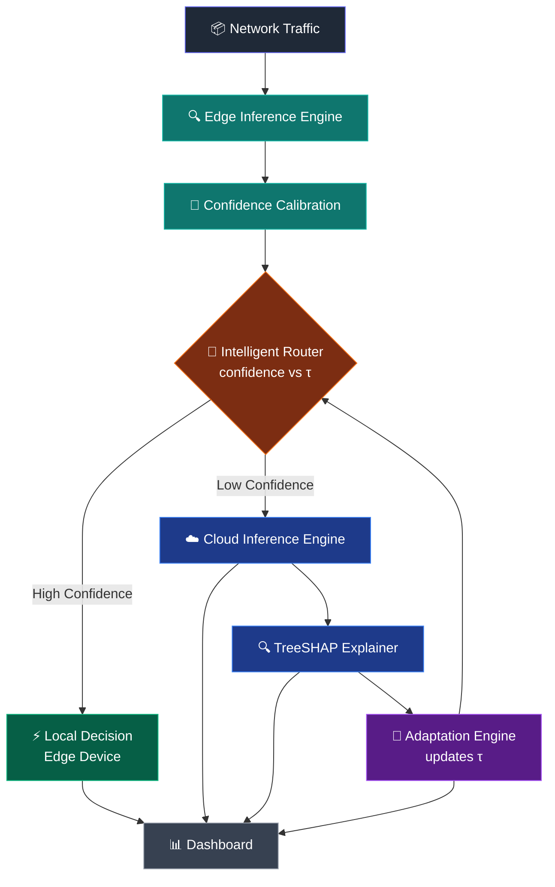
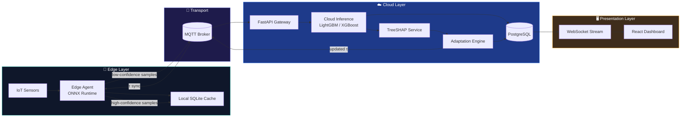

<div align="center">

# 🛡️ AECIDS

### Adaptive Explainable Edge–Cloud Intrusion Detection System

**Confidence-Calibrated Intelligent Routing for Resource-Constrained IoT Networks**

*Detect intrusions at the edge. Explain decisions in the cloud. Adapt in real time.*

<br/>

[](LICENSE)
[](https://www.python.org/)
[](https://fastapi.tiangolo.com/)
[](https://react.dev/)
[](https://www.docker.com/)
[](https://github.com/your-org/aecids/actions)
[](https://github.com/your-org/aecids/stargazers)
[](https://github.com/your-org/aecids/issues)
[](CONTRIBUTING.md)

<br/>


<sub>📌 Replace with your project banner — recommended size <code>1600×400</code></sub>

</div>

<br/>

> [!NOTE]
> AECIDS is an active research project exploring **confidence-calibrated edge–cloud routing** for intrusion detection in IoT environments. Interfaces, model formats, and APIs are evolving — see the [Roadmap](#-roadmap) for current status.

<br/>

---

## 📖 Table of Contents

- [🎯 Overview](#-overview)
- [✨ Key Features](#-key-features)
- [🧠 System Architecture](#-system-architecture)
- [🛠️ Technology Stack](#️-technology-stack)
- [📂 Repository Structure](#-repository-structure)
- [🔬 Research Contributions](#-research-contributions)
- [🗺️ Roadmap](#️-roadmap)
- [⚡ Installation](#-installation)
- [🚀 Usage](#-usage)
- [📡 API Reference](#-api-reference)
- [🖼️ Screenshots & Demo](#️-screenshots--demo)
- [📊 Performance](#-performance)
- [📄 Research Paper](#-research-paper)
- [🤝 Contributing](#-contributing)
- [📜 License](#-license)
- [📬 Contact](#-contact)

---

## 🎯 Overview

**AECIDS** rethinks how intrusion detection should work on resource-constrained IoT networks. Instead of blindly forwarding every packet to the cloud — burning bandwidth, battery, and latency budget — AECIDS makes a **local decision first** and only escalates when it's genuinely unsure.

```
📦 Traffic → 🔍 Edge Model → 🎚️ Confidence Check → ⚡ Local Decision  OR  ☁️ Cloud Escalation
```

**How it works, in a nutshell:**

1. 🔹 A **lightweight ML model** on the edge device (e.g. Raspberry Pi) scores incoming traffic in real time.
2. 🔹 A **confidence calibration layer** quantifies how trustworthy that prediction actually is.
3. 🔹 An **Intelligent Router** compares confidence against an adaptive threshold `τ` (tau):
   - **High confidence** → decision is finalized **on the edge**. ⚡ Fast, cheap, private.
   - **Low confidence** → sample is escalated to the **cloud** for deeper analysis. ☁️ Accurate, explainable.
4. 🔹 The cloud model's decisions are explained via **TreeSHAP**, producing feature-level attributions.
5. 🔹 An **Adaptation Engine** consumes those explanations and telemetry to **dynamically re-tune τ**, continuously balancing accuracy, latency, and cloud load.

> [!TIP]
> Think of `τ` as a living dial — AECIDS doesn't just route on a fixed rule, it *learns where to draw the line* between "the edge can handle this" and "send it upstairs."

---

## ✨ Key Features

| | Feature | Description |
|---|---|---|
| ⚙️ | **Edge AI** | Lightweight, quantized models built for microcontrollers and SBCs |
| ☁️ | **Cloud AI** | High-capacity models for deep, high-confidence inference |
| 🎯 | **Confidence Calibration** | Statistically calibrated confidence scores, not raw softmax guesses |
| 🔀 | **Intelligent Routing** | Confidence-driven edge/cloud decision routing |
| 🔄 | **Adaptive Threshold (τ)** | Self-tuning routing threshold based on live feedback |
| 🔍 | **Explainable AI (TreeSHAP)** | Transparent, feature-level explanations for every cloud decision |
| 🚀 | **FastAPI Backend** | High-performance async API layer |
| 📊 | **React Dashboard** | Real-time visualization of alerts, routing, and SHAP explanations |
| 🐳 | **Docker Deployment** | One-command reproducible deployment |
| 🍓 | **Raspberry Pi Support** | Validated on real constrained edge hardware |
| 🗄️ | **PostgreSQL** | Durable, queryable storage for events and telemetry |
| 📶 | **MQTT** | Lightweight publish/subscribe transport for IoT telemetry |
| 🔌 | **WebSocket** | Live streaming updates to the dashboard |
| 🧪 | **Research-Grade Evaluation** | Rigorous benchmarking pipeline for reproducible results |

---

## 🧠 System Architecture

### 🔗 Logical Pipeline



### 🏗️ Deployment Architecture



<details>
<summary>📐 <strong>View high-resolution architecture diagram (placeholder)</strong></summary>

<br/>


<sub>📌 Replace with detailed system diagram — export from Figma/Excalidraw at 2x resolution</sub>

</details>

---

## 🛠️ Technology Stack

<div align="center">

### Machine Learning & Explainability

| Technology | Purpose |
|---|---|
|  | Core language for ML pipeline & backend |
|  | Gradient-boosted edge/cloud classifiers |
|  | High-capacity cloud-side classifier |
|  | Optimized edge inference runtime |
|  | Calibration, preprocessing & metrics |
|  | Feature-level explainability engine |

### Backend & Data

| Technology | Purpose |
|---|---|
|  | Async REST/WebSocket API layer |
|  | Cloud-side persistent storage |
|  | Edge-side local caching |
|  | Lightweight IoT messaging transport |

### Frontend

| Technology | Purpose |
|---|---|
|  | Real-time monitoring dashboard |
|  | Type-safe frontend development |
|  | Utility-first UI styling |

### DevOps

| Technology | Purpose |
|---|---|
|  | Containerized edge & cloud services |
|  | Multi-service orchestration |
|  | CI/CD automation |

</div>

---

## 📂 Repository Structure

```
AECIDS/
├── 📁 edge/                        # Edge-side agent & inference
│   ├── 📁 models/                  # Quantized ONNX edge models
│   ├── 📁 calibration/             # Confidence calibration logic
│   ├── 📁 router/                  # Intelligent routing client
│   └── 📄 agent.py                 # Main edge agent entrypoint
│
├── 📁 cloud/                       # Cloud-side services
│   ├── 📁 api/                     # FastAPI application
│   │   ├── 📁 routes/              # REST & WebSocket endpoints
│   │   ├── 📁 services/            # Business logic
│   │   └── 📄 main.py              # API entrypoint
│   ├── 📁 models/                  # LightGBM / XGBoost cloud models
│   ├── 📁 explainability/          # TreeSHAP integration
│   └── 📁 adaptation/              # Adaptive threshold (τ) engine
│
├── 📁 dashboard/                   # React + TypeScript frontend
│   ├── 📁 src/
│   │   ├── 📁 components/
│   │   ├── 📁 pages/
│   │   └── 📁 hooks/
│   └── 📄 package.json
│
├── 📁 datasets/                    # Dataset loaders & preprocessing
├── 📁 evaluation/                  # Benchmarking & research metrics
├── 📁 docs/                        # Documentation & assets
│   └── 📁 assets/                  # Images, diagrams, banners
├── 📁 tests/                       # Unit & integration tests
├── 📁 docker/                      # Dockerfiles & compose configs
├── 📄 docker-compose.yml
├── 📄 requirements.txt
├── 📄 CONTRIBUTING.md
├── 📄 LICENSE
└── 📄 README.md
```

---

## 🔬 Research Contributions

<details open>
<summary><strong>1️⃣ Confidence-Calibrated Routing</strong></summary>
<br/>

Traditional edge–cloud IDS designs route traffic using static rules or raw model confidence — both are unreliable, since uncalibrated confidence scores are often overconfident. AECIDS applies **post-hoc calibration** (e.g., temperature scaling / isotonic regression) so that a "90% confident" prediction is *actually* right ~90% of the time, making routing decisions statistically meaningful rather than heuristic guesses.

</details>

<details>
<summary><strong>2️⃣ Adaptive Threshold Optimization</strong></summary>
<br/>

The routing threshold `τ` is not fixed. AECIDS' **Adaptation Engine** continuously observes cloud outcomes, SHAP-derived error patterns, and system load, then re-optimizes `τ` to balance three competing objectives:

- 🎯 **Detection accuracy**
- ⚡ **Edge latency**
- ☁️ **Cloud resource consumption**

</details>

<details>
<summary><strong>3️⃣ Explainable AI for Security Operators</strong></summary>
<br/>

Every cloud-side decision is paired with a **TreeSHAP explanation**, giving security analysts feature-level insight into *why* traffic was flagged — critical for trust, auditability, and regulatory compliance in production IDS deployments.

</details>

<details>
<summary><strong>4️⃣ Edge–Cloud Computing for IoT</strong></summary>
<br/>

AECIDS demonstrates a practical **split-inference paradigm** for constrained IoT fleets, minimizing bandwidth and latency while preserving the detection power of large cloud models — validated on real edge hardware (Raspberry Pi class devices).

</details>

<details>
<summary><strong>5️⃣ IoT Security at Scale</strong></summary>
<br/>

By combining lightweight local inference with selective cloud escalation, AECIDS offers a **deployable, scalable blueprint** for securing large, heterogeneous IoT networks without overwhelming central infrastructure.

</details>

---

## 🗺️ Roadmap

- [x] 🔬 Research & literature review
- [x] 🏗️ System architecture design
- [x] 📐 Methodology definition
- [ ] ⚙️ Edge implementation
- [ ] ☁️ Cloud implementation
- [ ] 📊 Dashboard development
- [ ] 🧪 Evaluation & benchmarking
- [ ] 📄 Publication

> [!NOTE]
> Track detailed progress on the [Project Board](https://github.com/your-org/aecids/projects) and [open issues](https://github.com/your-org/aecids/issues).

---

## ⚡ Installation

> [!WARNING]
> AECIDS is under active research development. APIs and model formats may change without notice — pin a specific release tag for reproducible experiments.

### Prerequisites

- Python 3.10+
- Node.js 18+
- Docker & Docker Compose
- (Optional) Raspberry Pi 4/5 for edge deployment

### 1. Clone the repository

```bash
git clone https://github.com/your-org/aecids.git
cd aecids
```

### 2. Set up the backend

```bash
python -m venv venv
source venv/bin/activate        # Windows: venv\Scripts\activate
pip install -r requirements.txt
```

### 3. Set up the dashboard

```bash
cd dashboard
npm install
```

### 4. Configure environment variables

```bash
cp .env.example .env
# Edit .env with your PostgreSQL, MQTT broker, and API settings
```

### 5. Launch with Docker Compose

```bash
docker compose up --build
```

---

## 🚀 Usage

### Start the cloud API

```bash
uvicorn cloud.api.main:app --host 0.0.0.0 --port 8000 --reload
```

### Start the edge agent

```bash
python edge/agent.py --config edge/config.yaml
```

### Launch the dashboard

```bash
cd dashboard
npm run dev
```

### Run the full evaluation suite

```bash
python evaluation/run_benchmarks.py --config evaluation/config.yaml
```

---

## 📡 API Reference

> [!NOTE]
> Full interactive API docs are auto-generated by FastAPI and served at `/docs` (Swagger UI) and `/redoc`.

| Method | Endpoint | Description |
|---|---|---|
| `POST` | `/api/v1/inference/edge` | Submit edge-side sample metadata |
| `POST` | `/api/v1/inference/cloud` | Trigger cloud inference for a routed sample |
| `GET` | `/api/v1/explain/{sample_id}` | Retrieve TreeSHAP explanation for a decision |
| `GET` | `/api/v1/threshold` | Get current adaptive routing threshold (τ) |
| `POST` | `/api/v1/threshold/update` | Trigger manual threshold recalculation |
| `GET` | `/api/v1/alerts` | List recent intrusion alerts |
| `GET` | `/api/v1/metrics` | Retrieve system performance metrics |
| `WS` | `/ws/live` | Real-time event stream for the dashboard |

---

## 🖼️ Screenshots & Demo

<div align="center">

### 🎬 Live Demo


<sub>📌 Replace with a recorded GIF/MP4 of the dashboard in action</sub>

<br/><br/>

| Dashboard Overview | Alert Feed |
|---|---|
|  |  |

| SHAP Explanation Graph | Threshold History |
|---|---|
|  |  |

| System Health Monitor | Architecture View |
|---|---|
|  |  |

</div>

---

## 📊 Performance

> [!NOTE]
> Benchmark figures below are placeholders — populate with results from `evaluation/run_benchmarks.py`.

### Detection Performance

| Model | Accuracy | Precision | Recall | F1-Score | AUC-ROC |
|---|---|---|---|---|---|
| Edge Model (LightGBM) | 0.0% | 0.0% | 0.0% | 0.0% | 0.00 |
| Cloud Model (XGBoost) | 0.0% | 0.0% | 0.0% | 0.0% | 0.00 |
| AECIDS (End-to-End) | 0.0% | 0.0% | 0.0% | 0.0% | 0.00 |

### Efficiency Metrics

| Metric | Edge-Only | Cloud-Only | AECIDS (Adaptive) |
|---|---|---|---|
| Avg. Latency (ms) | — | — | — |
| Cloud Offload Rate (%) | — | — | — |
| Bandwidth Usage (MB/hr) | — | — | — |
| Energy Consumption (J) | — | — | — |

> [!TIP]
> Run `python evaluation/run_benchmarks.py --export markdown` to auto-generate an up-to-date version of these tables.

---

## 📄 Research Paper

<details>
<summary><strong>📌 Problem Statement</strong></summary>
<br/>
IoT networks generate massive traffic volumes that overwhelm cloud-only intrusion detection systems, while edge-only systems lack the model capacity for high-accuracy detection. A gap exists for a system that intelligently balances the two.
</details>

<details>
<summary><strong>🎯 Objectives</strong></summary>
<br/>

- Design a confidence-calibrated routing mechanism between edge and cloud inference
- Develop an adaptive threshold optimization strategy driven by explainability signals
- Validate the system on real constrained IoT hardware
- Provide interpretable, auditable detection decisions via TreeSHAP

</details>

<details>
<summary><strong>💡 Novelty</strong></summary>
<br/>
Unlike prior edge–cloud IDS work that uses static or heuristic routing, AECIDS closes the loop between explainability and routing policy — SHAP-derived insight directly informs how the adaptive threshold evolves over time.
</details>

<details>
<summary><strong>🧪 Methodology</strong></summary>
<br/>
A two-tier inference pipeline is implemented: a lightweight quantized model on the edge and a high-capacity ensemble model in the cloud, connected via a confidence-calibrated router. Threshold adaptation is modeled as a continuous feedback-driven optimization process.
</details>

<details>
<summary><strong>📚 Datasets</strong></summary>
<br/>

- Placeholder — e.g., CICIoT2023, TON_IoT, N-BaIoT, or custom-collected traffic

</details>

<details>
<summary><strong>📏 Evaluation Metrics</strong></summary>
<br/>

- Accuracy, Precision, Recall, F1-Score, AUC-ROC
- Cloud offload rate & bandwidth savings
- Edge inference latency
- Calibration error (ECE)
- SHAP-based explanation fidelity

</details>

---

## 🤝 Contributing

Contributions are what make the open-source community an incredible place to learn, build, and collaborate. Any contributions you make are **greatly appreciated**.

1. 🍴 Fork the project
2. 🌿 Create your feature branch (`git checkout -b feature/AmazingFeature`)
3. ✅ Commit your changes (`git commit -m 'Add some AmazingFeature'`)
4. 📤 Push to the branch (`git push origin feature/AmazingFeature`)
5. 🔁 Open a Pull Request

> [!TIP]
> Please read [`CONTRIBUTING.md`](CONTRIBUTING.md) for our code of conduct, coding standards, and the process for submitting pull requests.

---

## 📜 License

Distributed under the **MIT License**. See [`LICENSE`](LICENSE) for full text.

---

## 📬 Contact

<div align="center">

[](https://github.com/your-org/aecids)
[](mailto:contact@aecids.dev)

</div>

---

<div align="center">

**Built with ❤️ for AI-powered IoT Security**

⭐️ If you find AECIDS useful, consider giving it a star!

</div>
