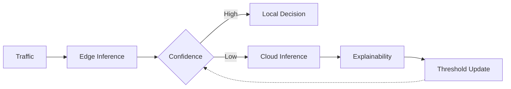
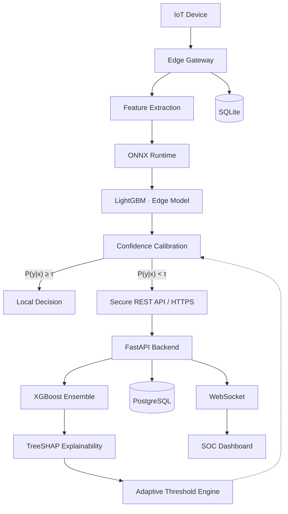
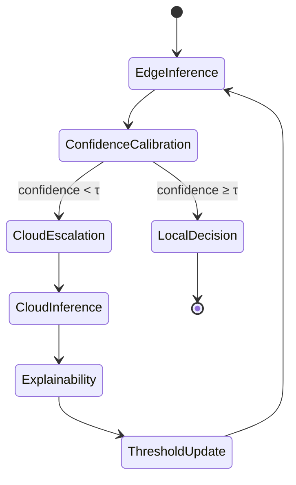
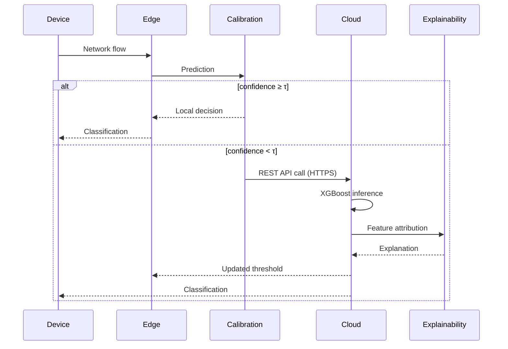
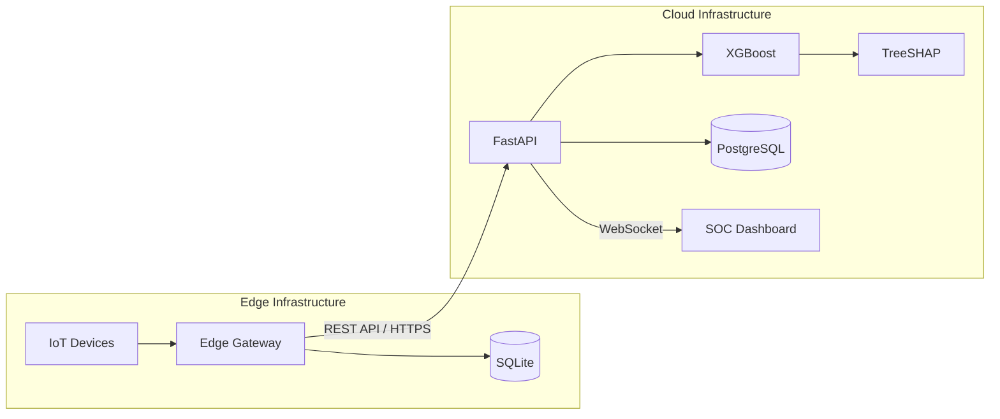
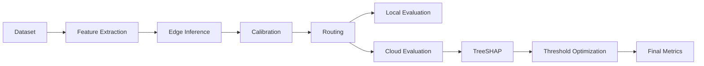

<div align="center">


<br/><br/>


<br/>

# AECIDS

### Adaptive Explainable Edge–Cloud Intrusion Detection System

**Confidence-calibrated intelligent routing for resource-constrained IoT networks**

<br/>

<sub>Engineering Design &amp; Innovation (EDI) Project&nbsp; · &nbsp;Department of Computer Engineering (Software Engineering)&nbsp; · &nbsp;2026–27</sub>

<br/><br/>

<!-- Tech badges — color-coded by layer -->


<!-- Status badges -->


<br/>

<p>
<a href="#overview"><b>Overview</b></a> &nbsp;&nbsp;•&nbsp;&nbsp;
<a href="#architecture"><b>Architecture</b></a> &nbsp;&nbsp;•&nbsp;&nbsp;
<a href="#engineering-principles"><b>Principles</b></a> &nbsp;&nbsp;•&nbsp;&nbsp;
<a href="#research-methodology"><b>Methodology</b></a> &nbsp;&nbsp;•&nbsp;&nbsp;
<a href="#installation"><b>Installation</b></a> &nbsp;&nbsp;•&nbsp;&nbsp;
<a href="#api-reference"><b>API</b></a> &nbsp;&nbsp;•&nbsp;&nbsp;
<a href="#security"><b>Security</b></a> &nbsp;&nbsp;•&nbsp;&nbsp;
<a href="#roadmap"><b>Roadmap</b></a>
</p>

</div>

<br/>


<br/>

## Overview

AECIDS is a research-driven hybrid intrusion detection framework built for resource-constrained IoT environments.

It combines lightweight edge inference, confidence-calibrated routing, cloud-assisted deep analysis, and explainable machine learning into a single cooperative architecture — rather than treating edge and cloud as isolated systems, AECIDS lets them adapt to uncertainty together, in real time.

<br/>

### Status

> [!IMPORTANT]
> This repository is under active engineering development. Backend, edge runtime, and dashboard are being implemented in parallel; experimental validation follows hardware integration.

<table>
<tr>
<td width="42%" valign="top">

**✅ Complete**
Literature survey · System architecture · Research methodology · Software design specification

**🔧 In progress**
Backend services · Edge runtime · SOC dashboard

**📋 Pending**
Experimental evaluation · Hardware validation

</td>
<td width="58%" valign="top">

| Track | Progress |
|---|---|
| Research | `████████████████████` 100% |
| Architecture | `████████████████████` 100% |
| Methodology | `████████████████████` 100% |
| Design Spec | `████████████████████` 100% |
| Backend | `████████████░░░░░░░░` 60% |
| Edge Runtime | `█████████░░░░░░░░░░░` 45% |
| SOC Dashboard | `██████████░░░░░░░░░░` 50% |
| Evaluation | `░░░░░░░░░░░░░░░░░░░░` 0% |

</td>
</tr>
</table>

<br/>

### Team

<div align="center">

| | | | |
|:---:|:---:|:---:|:---:|
| 👤 | 👤 | 👤 | 👤 |
| **Atharva Vavhal** | **Vedika Mehta** | **Swapnil Pawar** | **Janhavi Waychal** |
| `Team Leader` | `Team Member` | `Team Member` | `Team Member` |

</div>

<div align="center">
<sub>

**Institution** Vishwakarma Institute of Technology, Pune &nbsp;·&nbsp; **Department** Computer Engineering (Software Engineering) &nbsp;·&nbsp; **Course** Engineering Design &amp; Innovation &nbsp;·&nbsp; **Year** 2026–27

</sub>
</div>

<div align="right"><sub><a href="#aecids">⬆ back to top</a></sub></div>

<br/>

---

<br/>

## Problem Statement

Intrusion detection systems today are forced into one of two compromises.

<table>
<tr>
<td width="50%" valign="top">

#### 🔹 Edge-only

Extremely low latency, but constrained by memory, compute, and model complexity — weak against sophisticated, polymorphic, or previously unseen attacks.

</td>
<td width="50%" valign="top">

#### 🔹 Cloud-only

Far greater analytical capacity, but every flow must cross the network first — adding latency, WAN load, infrastructure cost, and a dependency on connectivity.

</td>
</tr>
</table>

> **The engineering challenge** is a system that delivers low edge latency, efficient cloud utilization, adaptive decision-making, explainable predictions, and deployability on constrained IoT gateways — simultaneously, not as a trade-off.

<br/>

---

<br/>

## Solution Overview

AECIDS introduces a hierarchical Edge–Cloud inference pipeline governed by confidence-calibrated routing. Every flow is first analyzed locally by a lightweight model. Its calibrated confidence score decides whether the prediction is trustworthy enough to act on immediately, or uncertain enough to escalate for deeper cloud analysis.

> Only uncertain traffic ever leaves the device — bandwidth and cloud cost scale with genuine ambiguity, not with total traffic volume.

<br/>

<table>
<tr><td width="26%">🧠&nbsp; <b>Edge Intelligence</b></td><td>Real-time lightweight intrusion detection</td></tr>
<tr><td>🎯&nbsp; <b>Confidence Calibration</b></td><td>Reliability estimation of every edge prediction</td></tr>
<tr><td>☁️&nbsp; <b>Cloud Intelligence</b></td><td>High-capacity secondary inference for uncertain flows</td></tr>
<tr><td>🔍&nbsp; <b>Explainable Adaptation</b></td><td>Dynamic optimization of the routing threshold</td></tr>
</table>



<div align="right"><sub><a href="#aecids">⬆ back to top</a></sub></div>

<br/>

---

<br/>

## Research Objectives

<table>
<tr><td width="28%">🟢&nbsp; <b>Edge efficiency</b></td><td>Low-latency detection on ARM64 gateways using lightweight models</td></tr>
<tr><td>🟢&nbsp; <b>Confidence-aware routing</b></td><td>Escalate to cloud only when calibrated confidence is insufficient</td></tr>
<tr><td>🟢&nbsp; <b>Explainable security</b></td><td>Interpretable predictions via exact TreeSHAP attribution</td></tr>
<tr><td>🟢&nbsp; <b>Adaptive intelligence</b></td><td>Routing behavior improves continuously through explanation-driven feedback</td></tr>
<tr><td>🟢&nbsp; <b>Operational resilience</b></td><td>Reliable operation through intermittent cloud connectivity</td></tr>
</table>

<br/>

### Novel Contributions

Unlike conventional IDS pipelines that statically partition work between edge and cloud, AECIDS closes the loop — explainability output directly shapes future routing decisions.

| Contribution | What it does |
|---|---|
| 🧩 **Confidence-Calibrated Routing** | Routes each flow based on calibrated posterior confidence, not raw probability |
| 🧠 **Explainable Adaptation Engine** | TreeSHAP attributions continuously retune the routing threshold |
| ⚙️ **Hybrid Inference Architecture** | Lightweight edge model paired with a high-capacity cloud ensemble |
| 📟 **Edge-Oriented Deployment** | Purpose-built for Raspberry Pi and industrial ARM64 gateways |
| 🔁 **Explainability Feedback Loop** | Feature-attribution drift becomes an optimization signal, not just a report |

<div align="right"><sub><a href="#aecids">⬆ back to top</a></sub></div>

<br/>

---

<br/>

## Architecture

AECIDS follows a **three-tier Edge–Cloud architecture** — Edge Layer, Cloud Layer, and Dashboard/UI Layer — with the Edge and Cloud communicating securely over REST APIs (HTTPS).



<br/>

<details open>
<summary><b>Routing state machine</b></summary>
<br/>



</details>

<details>
<summary><b>Request sequence</b></summary>
<br/>



</details>

<details>
<summary><b>Deployment topology</b></summary>
<br/>



</details>

<br/>

### Core components

<table>
<tr><td width="22%">🧠&nbsp; <b>Edge Intelligence</b></td><td>

ONNX-quantized LightGBM on the Raspberry Pi 5 (ARM64) target hardware. Target latency **&lt; 2 ms**, memory budget **&lt; 45 MB**, persisted locally through SQLite.

</td></tr>
<tr><td>🎯&nbsp; <b>Confidence Calibration</b></td><td>

Post-hoc calibration — Temperature Scaling and Platt Scaling — converts raw model output into a reliable posterior before any routing decision is made.

</td></tr>
<tr><td>☁️&nbsp; <b>Cloud Intelligence</b></td><td>

FastAPI-fronted XGBoost ensemble handles the flows the edge model is uncertain about, communicating over secure REST APIs and persisting to PostgreSQL.

</td></tr>
<tr><td>🔍&nbsp; <b>Explainable Adaptation</b></td><td>

Every cloud prediction produces exact TreeSHAP attributions. These aren't just displayed — feature-importance drift feeds directly back into the routing threshold controller, closing the loop.

</td></tr>
</table>

<div align="right"><sub><a href="#aecids">⬆ back to top</a></sub></div>

<br/>

---

<br/>

## Engineering Principles

AECIDS is built on five non-negotiable architectural principles.

<table>
<tr><td width="26%">1️⃣&nbsp; <b>Edge First</b></td><td>Every packet is evaluated locally before any cloud escalation is considered.</td></tr>
<tr><td>2️⃣&nbsp; <b>Confidence Before Complexity</b></td><td>Cloud inference triggers only when calibrated confidence falls below the adaptive threshold.</td></tr>
<tr><td>3️⃣&nbsp; <b>Explain Every Decision</b></td><td>Every cloud prediction carries an exact TreeSHAP feature attribution.</td></tr>
<tr><td>4️⃣&nbsp; <b>Adaptive Intelligence</b></td><td>Explainability output continuously improves routing behavior through closed-loop optimization.</td></tr>
<tr><td>5️⃣&nbsp; <b>Offline Resilience</b></td><td>Edge gateways keep operating through intermittent or total cloud outages via local inference and SQLite persistence.</td></tr>
</table>

> [!NOTE]
> Explainability is treated as an active optimization signal — not a passive visualization layer.

<br/>

<details>
<summary><b>📐 Architectural invariants</b></summary>
<br/>

- Every network flow is evaluated at the edge before cloud escalation
- Routing decisions depend exclusively on calibrated confidence
- Cloud inference is asynchronous
- TreeSHAP explanations accompany every cloud prediction
- Threshold optimization never bypasses confidence calibration
- SQLite guarantees offline persistence at the edge
- PostgreSQL serves as the centralized analytical data store
- Edge–cloud communication is encrypted end-to-end

</details>

<div align="right"><sub><a href="#aecids">⬆ back to top</a></sub></div>

<br/>

---

<br/>

## Research Methodology

Every flow moves through four sequential stages — computational cost scales with uncertainty, not with traffic volume.

<table>
<tr><td width="6%" align="center"><b>1</b></td><td width="34%"><b>Edge Inference</b></td><td>lightweight local prediction</td></tr>
<tr><td align="center"><b>2</b></td><td><b>Confidence Calibration</b></td><td>reliability estimate of that prediction</td></tr>
<tr><td align="center"><b>3</b></td><td><b>Cloud Escalation</b></td><td>deep inference for low-confidence flows only</td></tr>
<tr><td align="center"><b>4</b></td><td><b>Explainable Feedback</b></td><td>TreeSHAP output retunes the routing threshold</td></tr>
</table>

<br/>

### Mathematical formulation

**Temperature scaling** — calibrates raw logits `z = (z₁, …, z_K)` into a reliable posterior:

$$P_i = \frac{\exp(z_i / T)}{\sum_{j=1}^{K} \exp(z_j / T)}$$

where `T > 0` is the learned temperature and `K` is the number of classes.

**Adaptive routing function** — decides where each flow is handled:

$$Route(x) = \begin{cases} \text{Edge}, & P(y \mid x) \ge \tau \\ \text{Cloud}, & P(y \mid x) < \tau \end{cases}$$

**Threshold optimization** — the threshold itself is not static:

$$\tau = f(\Delta SHAP)$$

where `ΔSHAP` is the observed feature-attribution drift over time.

**TreeSHAP** — for every cloud prediction:

$$f(x) = \phi_0 + \sum_{i=1}^{M} \phi_i$$

where `φ₀` is the expected prediction and `φᵢ` is feature `i`'s contribution.

<div align="right"><sub><a href="#aecids">⬆ back to top</a></sub></div>

<br/>

---

<br/>

## Technology Stack

> [!NOTE]
> This stack is **frozen** for the duration of the project. All architecture diagrams, SDS/SRS documents, implementation plans, and deployment guides are written against it; it is not changed without an explicit decision to revise it.

AECIDS separates infrastructure into independent layers to simplify deployment, scaling, and maintenance.

<table>
<tr><td width="20%" valign="top">💻&nbsp; <b>Languages</b></td><td valign="top">

`Python 3.11+` · `TypeScript` · `SQL` · `Bash` · `YAML` · `Markdown`

</td></tr>
<tr><td valign="top">🤖&nbsp; <b>AI / Machine Learning</b></td><td valign="top">

`LightGBM` (edge model) · `XGBoost` (cloud model) · `TreeSHAP` (explainability) · `Scikit-learn` (feature scaling) · `Joblib` (serialization) · `ONNX Runtime` (edge deployment)

</td></tr>
<tr><td valign="top">📡&nbsp; <b>Edge Layer</b></td><td valign="top">

`Python` · `LightGBM` · `ONNX Runtime` · `NumPy` · `Pandas` · `Scikit-learn` · `Joblib` · `SQLite` · `Pydantic` · `Requests` · `PyShark` · `Scapy`

</td></tr>
<tr><td valign="top">☁️&nbsp; <b>Cloud Layer</b></td><td valign="top">

`FastAPI` · `Uvicorn` · `Gunicorn` · `XGBoost` · `SHAP (TreeSHAP)` · `Scikit-learn` · `NumPy` · `Pandas` · `Joblib` · `Pydantic`

</td></tr>
<tr><td valign="top">🖥️&nbsp; <b>Frontend</b></td><td valign="top">

`React` · `TypeScript` · `Vite` · `Tailwind CSS` · `React Router` · `Axios` · `Recharts` · `Lucide Icons`

</td></tr>
<tr><td valign="top">🗄️&nbsp; <b>Database</b></td><td valign="top">

`SQLite` (edge) · `PostgreSQL` (cloud)

</td></tr>
<tr><td valign="top">🔌&nbsp; <b>API Communication</b></td><td valign="top">

`REST API` · `JSON` · `HTTPS` · `WebSocket` (real-time dashboard updates) · `Multipart Upload` (where required)

</td></tr>
<tr><td valign="top">🔐&nbsp; <b>Security</b></td><td valign="top">

`JWT Authentication` · `Password Hashing` · `HTTPS` · `API Key Protection` · `Input Validation` · `RBAC` · `CORS Configuration`

</td></tr>
<tr><td valign="top">📶&nbsp; <b>Networking</b></td><td valign="top">

`IPv4` · `TCP` · `UDP` · `HTTP` · `HTTPS` · `Ethernet` · `Wi-Fi`

</td></tr>
<tr><td valign="top">🐳&nbsp; <b>Containerization &amp; Deployment</b></td><td valign="top">

`Docker` · `Docker Compose` · `Nginx` · `Ubuntu Server` (cloud) · `Linux Service` (edge)

</td></tr>
<tr><td valign="top">📟&nbsp; <b>Edge Hardware</b></td><td valign="top">

`Raspberry Pi 5` (target) · Linux laptop / mini PC / industrial gateway (alternative) — quad-core CPU, 4 GB RAM, 32 GB storage, Wi-Fi + Ethernet minimum

</td></tr>
<tr><td valign="top">🛠️&nbsp; <b>Development &amp; Testing</b></td><td valign="top">

`VS Code` · `Git` · `GitHub` (Issues, Projects, Actions) · `Docker Desktop` · `Postman` · `Swagger UI` · `Pytest`

</td></tr>
<tr><td valign="top">📄&nbsp; <b>Documentation</b></td><td valign="top">

`Markdown` · `Swagger / OpenAPI` · `Mermaid` · `PlantUML` (optional) · IEEE documentation format

</td></tr>
</table>

<br/>

### Engineering decisions

| Decision | Rationale |
|---|---|
| Edge-first inference | Minimize latency and bandwidth consumption |
| Confidence-calibrated routing | Avoid unnecessary cloud inference |
| ONNX Runtime | Portable inference across embedded hardware |
| SQLite at the edge | Offline persistence without operational overhead |
| PostgreSQL in the cloud | Scalable analytical storage |
| FastAPI | High-performance asynchronous API layer |
| TreeSHAP | Exact explainability for tree-based ensembles |
| REST over HTTPS for Edge↔Cloud | Simple, secure, firewall-friendly transport for escalated flows |
| WebSocket for the dashboard only | Real-time SOC updates without adding a broker to the Edge↔Cloud path |
| Raspberry Pi 5 as target hardware | Realistic, affordable stand-in for an industrial IoT gateway |

<div align="right"><sub><a href="#aecids">⬆ back to top</a></sub></div>

<br/>

---

<br/>

## Repository Structure

```text
AECIDS
├── backend/            FastAPI services — routers, calibration, explainability, database
├── edge-agent/          Edge runtime — inference, calibration, REST client, local storage
├── frontend/            React + TypeScript + Vite SOC dashboard
├── models/              Trained LightGBM / XGBoost artifacts
├── datasets/            Training, validation, and test data
├── docs/                Architecture notes, diagrams, research material
├── docker/              Container definitions
├── tests/                Test suites
├── scripts/             Utility and automation scripts
├── docker-compose.yml
├── requirements.txt
└── README.md
```

<table>
<tr><td width="18%"><code>backend/</code></td><td>Asynchronous FastAPI services: API routers, confidence calibration, TreeSHAP explainability, and the PostgreSQL data layer.</td></tr>
<tr><td><code>edge-agent/</code></td><td>The Raspberry Pi 5 runtime — packet capture, ONNX inference, calibration, REST client, SQLite-backed offline queue, and local monitoring.</td></tr>
<tr><td><code>frontend/</code></td><td>The SOC dashboard — components, pages, hooks, and services for the React/TypeScript/Vite UI.</td></tr>
<tr><td><code>models/</code></td><td>Serialized edge and cloud model artifacts.</td></tr>
<tr><td><code>datasets/</code></td><td>Data used for training and evaluation.</td></tr>
<tr><td><code>docs/</code></td><td>Architecture references, research notes, and image assets.</td></tr>
</table>

<div align="right"><sub><a href="#aecids">⬆ back to top</a></sub></div>

<br/>

---

<br/>

## Installation

<br/>

### Requirements

| Software | Version |
|---|---|
| Python | 3.11+ |
| Node.js | 20+ |
| Docker &amp; Docker Compose | Latest |
| PostgreSQL | 16+ |

<br/>

### Quick start

```bash
git clone https://github.com/<username>/AECIDS.git
cd AECIDS
docker compose up --build
```

<br/>

<details open>
<summary><b>Run components individually</b></summary>
<br/>

**Backend**

```bash
cd backend
python -m venv .venv
source .venv/bin/activate
pip install -r requirements.txt
uvicorn app.main:app --reload
```

**Frontend**

```bash
cd frontend
npm install
npm run dev
```

**Edge runtime**

```bash
cd edge-agent
python main.py
```

</details>

<br/>

### Configuration

The application is configured entirely through environment variables.

| Variable | Description |
|---|---|
| `DATABASE_URL` | PostgreSQL connection string |
| `SQLITE_PATH` | Edge database path |
| `CLOUD_API_URL` | Cloud REST API base URL (edge → cloud escalation) |
| `SECRET_KEY` | Application secret (JWT signing) |
| `JWT_ALGORITHM` | JWT signing algorithm |
| `CORS_ORIGINS` | Allowed dashboard origins |
| `MODEL_PATH` | ONNX model location |
| `THRESHOLD` | Initial routing threshold |

<div align="right"><sub><a href="#aecids">⬆ back to top</a></sub></div>

<br/>

---

<br/>

## API Reference

> [!NOTE]
> The REST API follows the OpenAPI specification and is fully documented through FastAPI's autogenerated interactive docs.

<br/>

### REST

| Method | Endpoint | Description |
|---|---|---|
| `GET` | `/health` | Service health |
| `POST` | `/auth/login` | JWT authentication |
| `POST` | `/predict` | Edge prediction |
| `POST` | `/cloud/predict` | Cloud inference (REST, HTTPS) |
| `GET` | `/metrics` | Runtime metrics |
| `GET` | `/threshold` | Current routing threshold |
| `POST` | `/threshold` | Update routing threshold |

<br/>

### WebSocket

| Endpoint | Description |
|---|---|
| `/ws/events` | Live security events |
| `/ws/alerts` | Alert streaming |
| `/ws/status` | Gateway health |
| `/ws/logs` | Runtime logs |

<div align="right"><sub><a href="#aecids">⬆ back to top</a></sub></div>

<br/>

---

<br/>

## Security

Access to the API and dashboard is governed by the following controls:

<table>
<tr><td width="26%">🔑&nbsp; <b>JWT Authentication</b></td><td>Stateless token-based auth for all protected endpoints</td></tr>
<tr><td>🔒&nbsp; <b>Password Hashing</b></td><td>Credentials are never stored in plaintext</td></tr>
<tr><td>🌐&nbsp; <b>HTTPS</b></td><td>All Edge↔Cloud and Dashboard↔Cloud traffic is encrypted in transit</td></tr>
<tr><td>🗝️&nbsp; <b>API Key Protection</b></td><td>Service-to-service calls require a valid API key</td></tr>
<tr><td>✅&nbsp; <b>Input Validation</b></td><td>Pydantic models validate every request payload</td></tr>
<tr><td>👥&nbsp; <b>Role-Based Access Control</b></td><td>Dashboard permissions scale with the analyst's role</td></tr>
<tr><td>🚧&nbsp; <b>CORS Configuration</b></td><td>Explicit allow-list restricts which origins can call the API</td></tr>
</table>

<div align="right"><sub><a href="#aecids">⬆ back to top</a></sub></div>

<br/>

---

<br/>

## Security Operations Center

The SOC dashboard centralizes monitoring of edge gateways, cloud inference, routing behavior, and explainability results — designed for operational clarity over visual complexity.

<table>
<tr><td width="22%">📊&nbsp; <b>Overview</b></td><td>High-level system health and traffic summary</td></tr>
<tr><td>🚨&nbsp; <b>Threat Feed</b></td><td>Real-time intrusion events</td></tr>
<tr><td>📡&nbsp; <b>Edge Gateways</b></td><td>Connected gateway monitoring</td></tr>
<tr><td>☁️&nbsp; <b>Cloud Analytics</b></td><td>Secondary inference statistics</td></tr>
<tr><td>🔍&nbsp; <b>Explainability</b></td><td>TreeSHAP feature attribution</td></tr>
<tr><td>🎚️&nbsp; <b>Threshold Monitor</b></td><td>Adaptive routing visualization</td></tr>
<tr><td>📜&nbsp; <b>Audit Logs</b></td><td>Historical event timeline</td></tr>
</table>

<br/>

<div align="center">

<sub>Dashboard previews — populated as the SOC UI is completed</sub>

<br/><br/>

<table>
<tr>
<td align="center" width="33%"><sub><code>docs/images/soc-dashboard.png</code></sub><br/><sub>SOC Overview</sub></td>
<td align="center" width="33%"><sub><code>docs/images/threat-feed.png</code></sub><br/><sub>Live Threat Feed</sub></td>
<td align="center" width="33%"><sub><code>docs/images/shap-dashboard.png</code></sub><br/><sub>Explainability View</sub></td>
</tr>
</table>

</div>

<div align="right"><sub><a href="#aecids">⬆ back to top</a></sub></div>

<br/>

---

<br/>

## Datasets &amp; Evaluation

> [!NOTE]
> Quantitative benchmark results will be published only after experimental validation. No empirical values are reported until they are reproducible.

<br/>

### Evaluation objectives

| Objective | Description |
|---|---|
| Edge performance | Latency and memory utilization of the embedded inference engine |
| Cloud performance | Inference throughput and request scalability |
| Routing efficiency | Share of flows resolved locally vs. escalated to the cloud |
| Calibration quality | Reliability of confidence estimates after post-hoc calibration |
| Explainability | Consistency and usefulness of TreeSHAP attributions |
| Adaptation | Threshold evolution under changing traffic distributions |

<br/>



<br/>

### Benchmark categories

| Category | Metrics |
|---|---|
| Classification | Accuracy, Precision, Recall, F1, ROC-AUC |
| Edge runtime | Latency, memory usage, CPU utilization |
| Cloud runtime | Throughput, response time |
| Communication | Escalation rate, network overhead |
| Explainability | SHAP stability, feature drift |
| Adaptation | Threshold stability, routing efficiency |

<sub>All experiments — edge and cloud benchmarking, hardware validation, routing and explainability analysis, comparative study — are currently **planned**, pending hardware-in-the-loop evaluation.</sub>

<div align="right"><sub><a href="#aecids">⬆ back to top</a></sub></div>

<br/>

---

<br/>

## Design Constraints

The project is deliberately shaped by practical deployment limits.

| Constraint | Response |
|---|---|
| Limited RAM | Quantized edge model |
| Limited CPU | Lightweight inference pipeline |
| Network instability | Offline SQLite queue |
| Cloud cost | Confidence-aware routing |
| Explainability requirement | TreeSHAP integration |
| Scalability | Asynchronous FastAPI backend |

<br/>

---

<br/>

## Roadmap

| Milestone | Status |
|---|---|
| Research completion | ✅ Complete |
| Architecture finalization | ✅ Complete |
| Software design specification | ✅ Complete |
| Backend services | 🔧 In progress |
| Edge runtime | 🔧 In progress |
| SOC dashboard | 🔧 In progress |
| Experimental validation | 📋 Planned |
| Research publication | 📋 Planned |

<br/>

### Future scope

<table>
<tr><td width="50%" valign="top">

- Federated learning across distributed edge gateways
- Online continual learning for evolving threat landscapes
- Multi-edge collaborative inference
- Container orchestration with Kubernetes

</td><td width="50%" valign="top">

- Additional explainability techniques
- Hardware acceleration — NVIDIA Jetson, Coral TPU
- Integration with enterprise SIEM platforms
- Large-scale industrial IoT deployments

</td></tr>
</table>

<div align="right"><sub><a href="#aecids">⬆ back to top</a></sub></div>

<br/>

---

<br/>

## Contributing

Contributions are welcome. Before opening a pull request:

- Confirm the change aligns with the architectural principles above
- Update documentation alongside implementation
- Include appropriate tests for new functionality
- Preserve backward compatibility where possible

> [!TIP]
> For significant architectural proposals, open an issue first.

<br/>

---

<br/>

## License

Distributed under the **MIT License**. See [`LICENSE`](./LICENSE) for details.

<br/>

## Citation

A formal BibTeX citation will be added once the accompanying research paper is publicly available.

<br/>

---

<br/>

<div align="center">


<br/><br/>

**AECIDS** — Adaptive Explainable Edge–Cloud Intrusion Detection System

Engineering Design &amp; Innovation · Department of Computer Engineering (Software Engineering)
Vishwakarma Institute of Technology, Pune · 2026–27

<sub>© 2026 AECIDS Project Team</sub>

</div>
