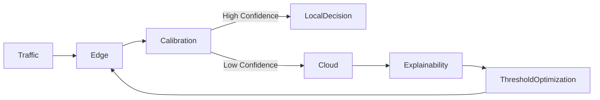
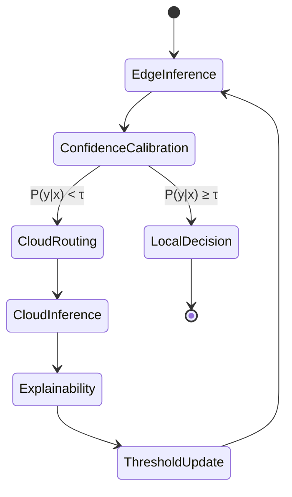
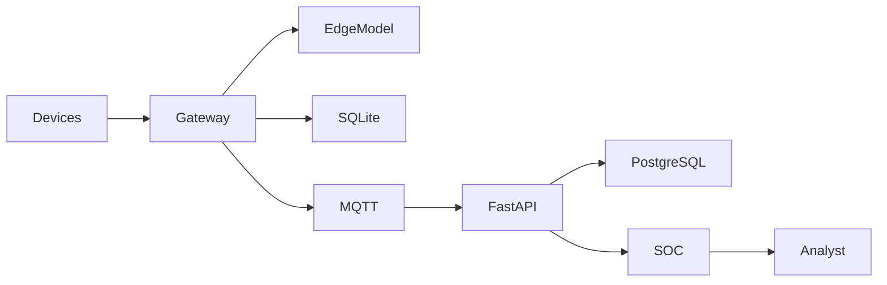
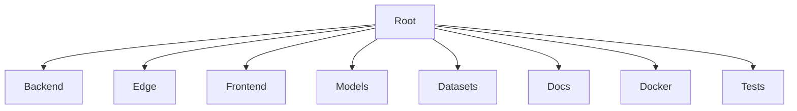

<div align="center">


<br><br>


# AECIDS

### Adaptive Explainable Edge–Cloud Intrusion Detection System using Confidence-Calibrated Intelligent Routing for Resource-Constrained IoT Networks

Research Project • Engineering Design & Innovation (EDI) • Smart Kopargaon Hackathon • Academic Year 2026–27

<br>


<br><br>

<a href="#overview">Overview</a> •
<a href="#architecture">Architecture</a> •
<a href="#engineering-principles">Engineering Principles</a> •
<a href="#installation">Installation</a> •
<a href="#api-reference">API</a> •
<a href="#roadmap">Roadmap</a>

</div>

---

# Overview

AECIDS is a research-driven hybrid intrusion detection framework designed for resource-constrained Internet of Things (IoT) environments.

The project combines lightweight edge inference, confidence-calibrated intelligent routing, cloud-assisted deep analysis, and explainable machine learning into a unified security architecture.

Rather than treating edge and cloud as isolated systems, AECIDS models them as cooperative inference layers capable of dynamically adapting to uncertainty while maintaining low latency and efficient resource utilization.

---

# Project Status

> [!IMPORTANT]
> This repository is under active engineering development.

| Phase | Status |
|---------|--------|
| Literature Survey | Complete |
| System Architecture | Complete |
| Research Methodology | Complete |
| Software Design Specification | Complete |
| Backend Development | In Progress |
| Edge Runtime | In Progress |
| SOC Dashboard | In Progress |
| Experimental Evaluation | Pending |

```
Research & Literature Review        ████████████████████ 100%

System Architecture                 ████████████████████ 100%

Research Methodology                ████████████████████ 100%

Software Design Specification       ████████████████████ 100%

Backend Services                    ████████████░░░░░░░░  In Progress

Edge Runtime                        █████████░░░░░░░░░░░  In Progress

SOC Dashboard                       ██████████░░░░░░░░░░  In Progress

Experimental Validation             ░░░░░░░░░░░░░░░░░░░░  Pending
```

---

# Project Team

| Member | Role |
|---------|------|
| **Atharva Vavhal** | Team Leader |
| **Vedika Mehta** | Team Member |
| **Swapnil Pawar** | Team Member |
| **Janhavi Waychal** | Team Member |

### Academic Information

| Item | Value |
|------|-------|
| Institution | Vishwakarma Institute of Technology (VIT), Pune |
| Department | Computer Engineering (Software Engineering) |
| Course | Engineering Design & Innovation (EDI) |
| Academic Year | 2026–27 |

---

# Table of Contents

- Overview
- Problem Statement
- Solution Overview
- Research Objectives
- Novel Contributions
- System Architecture
- Engineering Principles
- Research Methodology
- Mathematical Formulation
- Technology Stack
- Repository Structure
- Installation
- Deployment
- API Reference
- SOC Dashboard
- Experimental Evaluation
- Roadmap
- Contributing
- License

---

# Problem Statement

Modern intrusion detection systems generally follow one of two architectural paradigms.

## Edge-Only Systems

Edge-native IDS architectures provide extremely low inference latency but remain constrained by computational resources, memory budgets, and model complexity.

These limitations significantly reduce their ability to detect sophisticated, polymorphic, and previously unseen attacks.

---

## Cloud-Only Systems

Cloud-native security pipelines provide substantially greater computational capacity and support larger machine learning models.

However, every network flow must traverse the network before inference can occur, increasing latency, WAN utilization, infrastructure cost, and dependency on stable connectivity.

---

## Engineering Challenge

Design an intrusion detection framework capable of simultaneously providing

- low edge latency,
- efficient cloud utilization,
- adaptive decision making,
- explainable predictions,
- and deployment on resource-constrained IoT gateways.

---

# Solution Overview

AECIDS introduces a hierarchical Edge–Cloud inference pipeline governed by confidence-calibrated intelligent routing.

Instead of forwarding every packet to the cloud, each network flow is first analyzed locally using a lightweight machine learning model.

The calibrated confidence score determines whether the prediction is sufficiently reliable for immediate edge execution or whether the sample should be escalated for deeper cloud analysis.

Only uncertain traffic is transmitted to the cloud, reducing bandwidth utilization while preserving analytical capability for complex attack patterns.

---

## Four-Layer Architecture

| Layer | Responsibility |
|---------|----------------|
| Edge Intelligence | Real-time lightweight intrusion detection |
| Confidence Calibration | Reliability estimation of edge predictions |
| Cloud Intelligence | High-capacity secondary inference |
| Explainable Adaptation Engine | Dynamic optimization of routing threshold |

---

## High-Level Workflow



---

# Why Edge–Cloud?

Traditional IDS architectures force developers to choose between speed and intelligence.

AECIDS removes this trade-off by introducing an adaptive routing mechanism capable of selecting the appropriate computational layer for each individual network flow.

The result is a system that remains lightweight under normal operating conditions while preserving the analytical capability required for uncertain or anomalous traffic.

---

# Design Philosophy

AECIDS is designed around five architectural principles.

## Edge First

Every packet is evaluated locally before cloud escalation.

---

## Confidence Before Complexity

Cloud inference occurs only when prediction confidence falls below the adaptive routing threshold.

---

## Explain Every Decision

Every cloud prediction produces exact TreeSHAP feature attributions.

---

## Adaptive Intelligence

Explainability continuously improves routing behaviour through closed-loop threshold optimization.

---

## Offline Resilience

Edge gateways continue operating during intermittent or complete cloud connectivity loss through local inference and embedded SQLite storage.

---[API](#api-reference) •
[Roadmap](#roadmap--future-scope)

</div>

---

# Project Status

> [!IMPORTANT]
> **AECIDS is currently under active engineering development.**
>
> - ✅ Research completed
> - ✅ System architecture completed
> - ✅ Engineering methodology completed
> - ✅ Software Design Specification (SDS) completed
> - 🚧 Backend implementation in progress
> - 🚧 Edge inference agent in progress
> - 🚧 Security Operations Center (SOC) dashboard in progress
> - ⏳ Experimental evaluation pending hardware validation

```text
Research & Literature Review        ████████████████████ 100%
System Architecture                 ████████████████████ 100%
Methodology                         ████████████████████ 100%
Software Design Specification       ████████████████████ 100%
Backend Services                    ████████████░░░░░░░  In Progress
Edge Runtime                        █████████░░░░░░░░░░  In Progress
SOC Dashboard                       ██████████░░░░░░░░░  In Progress
Experimental Evaluation             ░░░░░░░░░░░░░░░░░░░  Pending
```

---

# Project Team

| Name | Role | Academic Affiliation |
|------|------|----------------------|
| **Atharva Vavhal** | Team Leader | Vishwakarma Institute of Technology, Pune |
| **Vedika Mehta** | Team Member | Vishwakarma Institute of Technology, Pune |
| **Swapnil Pawar** | Team Member | Vishwakarma Institute of Technology, Pune |
| **Janhavi Waychal** | Team Member | Vishwakarma Institute of Technology, Pune |

**Department:** Computer Engineering (Software Engineering)

**Course:** Engineering Design & Innovation (EDI)

**Academic Year:** 2026–27

---

# Table of Contents

- About the Project
- Problem Statement
- Solution Overview
- Research Objectives
- Novel Contributions
- Key Features
- System Architecture
- Technology Stack
- Engineering Design Approach
- Research Methodology
- Mathematical Formulation
- Datasets
- Evaluation Metrics
- Repository Structure
- Installation
- API Reference
- UI Screenshots
- Roadmap
- Contributing
- License
- Contact

---

# About the Project

AECIDS is an adaptive hybrid intrusion detection framework designed for resource-constrained IoT deployments where traditional edge-only and cloud-only security architectures exhibit complementary limitations.

The system combines lightweight edge inference with confidence-aware cloud escalation, enabling efficient processing of routine traffic while preserving analytical capacity for ambiguous, previously unseen, or potentially polymorphic attacks.

Rather than treating edge and cloud as independent components, AECIDS models them as cooperative inference layers connected through a confidence-calibrated routing mechanism and an explainability-driven feedback loop.

---

# Problem Statement

Modern IoT environments face two competing constraints.

| Edge-only IDS | Cloud-only IDS |
|---------------|----------------|
| Limited computational capacity | WAN dependency |
| Reduced capability against zero-day attacks | Increased inference latency |
| Restricted model complexity | High bandwidth utilization |
| Limited adaptability | Increased operational cost |

AECIDS addresses these limitations through a hierarchical Edge–Cloud architecture that dynamically selects the most appropriate inference layer based on calibrated prediction confidence.

---

# Solution Overview

The system consists of four tightly integrated layers.

| Layer | Purpose |
|--------|----------|
| Edge Intelligence | Real-time lightweight inference |
| Confidence Calibration | Reliable uncertainty estimation |
| Cloud Intelligence | High-capacity secondary analysis |
| Explainable Adaptation Engine | Continuous optimization of routing threshold |

---

# Research Objectives

- Design an adaptive Edge–Cloud intrusion detection architecture.
- Reduce unnecessary cloud inference through confidence-calibrated routing.
- Preserve low latency for routine traffic.
- Improve handling of uncertain and zero-day attack patterns.
- Generate explainable security decisions using TreeSHAP.
- Continuously optimize routing behaviour through feature importance drift analysis.

---

# Novel Contributions

| Contribution | Description |
|--------------|-------------|
| Confidence-Calibrated Routing | Dynamic routing based on calibrated prediction confidence |
| Explainable Adaptation Engine | TreeSHAP-driven adaptive threshold optimization |
| Hybrid Inference Pipeline | Lightweight edge inference with cloud escalation |
| Resource-Constrained Deployment | Designed for Raspberry Pi and industrial gateways |
| Closed-Loop Learning | Explainability continuously improves routing behaviour |

---

# Key Features

| Feature | Description |
|----------|-------------|
| Edge Inference | ONNX-quantized LightGBM model |
| Cloud Analysis | High-capacity XGBoost ensemble |
| Confidence Calibration | Temperature Scaling + Platt Calibration |
| Explainability | Exact TreeSHAP feature attribution |
| Edge Storage | SQLite offline queue and audit logs |
| Cloud Storage | PostgreSQL security data lake |
| Communication | MQTT and WebSockets |
| Backend | FastAPI asynchronous services |
| Dashboard | React + TypeScript + TailwindCSS SOC UI |
| Deployment | Docker containers |

---

# System Architecture

## End-to-End Architecture

```mermaid
graph TD

A[IoT Devices]

A --> B[Edge Gateway]

B --> C[ONNX Runtime]

C --> D[LightGBM Edge Model]

D --> E[Confidence Calibration]

E -->|P(y|x) ≥ τ| F[Local Decision]

E -->|P(y|x) < τ| G[Secure MQTT/WebSocket]

G --> H[FastAPI Backend]

H --> I[XGBoost Ensemble]

I --> J[TreeSHAP]

J --> K[Adaptive Threshold Controller]

K --> E

H --> L[PostgreSQL]

B --> M[SQLite]
```

---

## Intelligent Routing State Machine



---

## Edge–Cloud Sequence Workflow


---

## Deployment Topology



---

# Technology Stack

## Machine Learning

| Component | Technology |
|------------|------------|
| Edge Model | LightGBM |
| Cloud Model | XGBoost |
| Explainability | TreeSHAP |
| Runtime | ONNX Runtime |

---

## Backend

| Component | Technology |
|------------|------------|
| API | FastAPI |
| Language | Python |
| Async Runtime | Uvicorn |
| Communication | MQTT / WebSockets |

---

## Frontend

| Component | Technology |
|------------|------------|
| Framework | React 18 |
| Language | TypeScript |
| Styling | TailwindCSS |

---

## Databases

| Purpose | Technology |
|----------|------------|
| Edge Queue | SQLite |
| Cloud Storage | PostgreSQL 16+ |

---

## Deployment

| Component | Technology |
|-----------|------------|
| Containers | Docker |
| Edge Hardware | Raspberry Pi (ARM64) |
| Gateway | Industrial Edge Gateway |

---

# Engineering Design Approach

> [!IMPORTANT]
> The architectural separation between edge inference and cloud inference is a fundamental design invariant.

### Level 0

- ONNX Runtime
- Quantized LightGBM
- Memory budget below 45 MB
- Target latency below 2.0 ms

### Level 1

- FastAPI
- XGBoost Ensemble
- Explainability Engine
- Adaptive threshold optimization

### Design Invariants

- Edge inference always executes first.
- Cloud inference executes only for low-confidence samples.
- Every cloud prediction produces TreeSHAP explanations.
- Threshold optimization is explainability driven.
- Edge and cloud communicate only through secure channels.

---

# Research Methodology

The routing mechanism is governed by calibrated confidence estimation.

## Temperature Scaling

\[
P_i=\frac{\exp(z_i/T)}
{\sum_j \exp(z_j/T)}
\]

where

- \(z_i\) denotes model logits
- \(T\) is the learned temperature parameter

---

## Adaptive Routing Threshold

\[
Route(x)=
\begin{cases}
Edge, & P(y|x)\ge \tau\\
Cloud, & P(y|x)<\tau
\end{cases}
\]

where

\[
\tau=f(\Delta SHAP)
\]

---

## TreeSHAP

For each prediction,

\[
f(x)=\phi_0+\sum_{i=1}^{M}\phi_i
\]

where

- \(\phi_i\) denotes the contribution of feature \(i\)
- \(\phi_0\) is the expected prediction

---

# Datasets & Evaluation Metrics

## Datasets

| Dataset | Status |
|----------|--------|
| Dataset Selection | In Progress |
| Training Dataset | [To be documented] |
| Validation Dataset | [To be documented] |
| Test Dataset | [To be documented] |

---

## Evaluation Metrics

| Metric | Result |
|---------|--------|
| Accuracy | [To be evaluated] |
| Precision | [To be evaluated] |
| Recall | [To be evaluated] |
| F1 Score | [To be evaluated] |
| ROC-AUC | [To be evaluated] |
| Edge Latency | [To be evaluated] |
| Cloud Latency | [To be evaluated] |
| Memory Usage | [To be evaluated] |
| Energy Consumption | [To be evaluated] |

> [!NOTE]
> Performance metrics will be published after hardware-in-the-loop evaluation and experimental validation.

---

# Repository Structure

```text
AECIDS
│
├── backend/
├── edge-agent/
├── frontend/
├── models/
├── datasets/
├── docs/
│   ├── images/
│   ├── architecture/
│   └── research/
├── scripts/
├── docker/
├── tests/
├── docker-compose.yml
├── requirements.txt
└── README.md
```

---

## Repository Layout



---

# Installation & Quick Start

## Clone

```bash
git clone https://github.com/<username>/AECIDS.git

cd AECIDS
```

---

## Docker Compose

```bash
docker compose up --build
```

---

## Backend

```bash
cd backend

pip install -r requirements.txt

uvicorn app.main:app --reload
```

---

## Frontend

```bash
cd frontend

npm install

npm run dev
```

---

## Edge Agent

```bash
cd edge-agent

python main.py
```

---

# API Reference

## REST Endpoints

| Method | Endpoint | Description |
|---------|----------|-------------|
| GET | /health | Service health |
| POST | /predict | Edge prediction |
| POST | /cloud/predict | Cloud inference |
| GET | /metrics | Runtime metrics |
| GET | /threshold | Current routing threshold |

---

## WebSocket

| Endpoint | Purpose |
|-----------|---------|
| /ws/events | Live SOC events |
| /ws/alerts | Security alerts |
| /ws/status | Gateway status |

---

# UI Screenshots

| Security Operations Center | Edge Monitoring |
|----------------------------|-----------------|
| `docs/images/soc-dashboard.png` | `docs/images/edge-dashboard.png` |

| Explainability | Threat Timeline |
|----------------|-----------------|
| `docs/images/shap-analysis.png` | `docs/images/threat-timeline.png` |

---

# Roadmap & Future Scope

| Phase | Status |
|---------|--------|
| Research & Architecture | ✅ Complete |
| SDS Documentation | ✅ Complete |
| Backend Services | 🚧 In Progress |
| Edge Runtime | 🚧 In Progress |
| SOC Dashboard | 🚧 In Progress |
| Experimental Evaluation | ⏳ Planned |
| Hardware Validation | ⏳ Planned |
| Research Publication | ⏳ Planned |

---

# Contributing

Contributions are welcome.

Please open an issue before submitting significant architectural or implementation changes.

---

# License

This project is distributed under the **MIT License**.

See the `LICENSE` file for additional information.

---

# Contact

**Project**

AECIDS — Adaptive Explainable Edge–Cloud Intrusion Detection System

**Institution**

Vishwakarma Institute of Technology (VIT), Pune

Department of Computer Engineering (Software Engineering)

---

<div align="center">

---

**Vishwakarma Institute of Technology (VIT), Pune • Department of Computer Engineering • Made with ❤️ in Pune, India**

</div>
