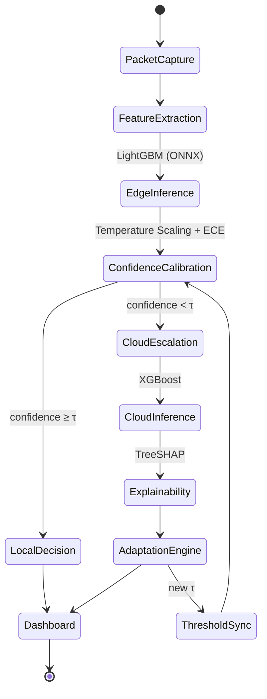

 

# AECIDS

### Adaptive Explainable Edge–Cloud Intrusion Detection System

**Confidence-calibrated intelligent routing for resource-constrained IoT networks**

 

Engineering Design &amp; Innovation (EDI) Project&nbsp; · &nbsp;Department of Computer Engineering (Software Engineering)&nbsp; · &nbsp;2026–27

  

<!-- Hero badges — core stack only, 16 max. Full dependency list lives in Technology Stack. -->

Full dependency list in <a href="#technology-stack">Technology Stack</a>

 

<!-- Status badges -->

 

<a href="#overview"><b>Overview</b></a> &nbsp;&nbsp;•&nbsp;&nbsp;
<a href="#architecture"><b>Architecture</b></a> &nbsp;&nbsp;•&nbsp;&nbsp;
<a href="#system-workflow"><b>Workflow</b></a> &nbsp;&nbsp;•&nbsp;&nbsp;
<a href="#engineering-principles"><b>Principles</b></a> &nbsp;&nbsp;•&nbsp;&nbsp;
<a href="#research-methodology"><b>Methodology</b></a> &nbsp;&nbsp;•&nbsp;&nbsp;
<a href="#installation"><b>Installation</b></a> &nbsp;&nbsp;•&nbsp;&nbsp;
<a href="#api-reference"><b>API</b></a> &nbsp;&nbsp;•&nbsp;&nbsp;
<a href="#security"><b>Security</b></a> &nbsp;&nbsp;•&nbsp;&nbsp;
<a href="#monitoring"><b>Monitoring</b></a> &nbsp;&nbsp;•&nbsp;&nbsp;
<a href="#roadmap"><b>Roadmap</b></a>

 

 

## Overview

AECIDS is a research-driven hybrid intrusion detection framework built for resource-constrained IoT environments.

It combines lightweight edge inference, confidence-calibrated routing, cloud-assisted deep analysis, and explainable machine learning into a single cooperative architecture — rather than treating edge and cloud as isolated systems, AECIDS lets them adapt to uncertainty together, in real time.

 

### Project Status &amp; Progress

> [!IMPORTANT]
> This project is at the **design and specification stage**. Architecture, research methodology, and the technical stack are frozen. No implementation code exists in the repository yet — statuses below reflect only what has actually been built, not what is planned.

<table>
<tr><td width="34%"><b>Module</b></td><td width="16%"><b>Status</b></td><td><b>Notes</b></td></tr>
<tr><td>Literature Review</td><td>⬜ Not Started</td><td>No document in repo yet</td></tr>
<tr><td>System Architecture</td><td>✅ Complete</td><td>Three-tier Edge/Cloud/Dashboard architecture frozen and diagrammed</td></tr>
<tr><td>Research Methodology</td><td>✅ Complete</td><td>11-step workflow, calibration math, routing rule, TreeSHAP formulation frozen</td></tr>
<tr><td>Software Design Spec (SDS)</td><td>⚠ Partially Implemented</td><td>Inputs exist (architecture, workflow, stack); no standalone SDS document yet</td></tr>
<tr><td>Backend API</td><td>⬜ Not Started</td><td>No <code>backend/</code> code</td></tr>
<tr><td>Authentication</td><td>⬜ Not Started</td><td>No auth code</td></tr>
<tr><td>Database</td><td>⬜ Not Started</td><td>Schema named in docs; no migrations or DB code</td></tr>
<tr><td>Edge Runtime</td><td>⬜ Not Started</td><td>No <code>edge-agent/</code> code</td></tr>
<tr><td>Feature Extraction</td><td>⬜ Not Started</td><td>No code</td></tr>
<tr><td>Edge AI Model</td><td>⬜ Not Started</td><td>Model choice specified (LightGBM + ONNX); untrained, unimplemented</td></tr>
<tr><td>Confidence Calibration</td><td>⬜ Not Started</td><td>Method specified (Temperature Scaling + ECE); no code</td></tr>
<tr><td>Intelligent Routing</td><td>⬜ Not Started</td><td>Rule specified; no code</td></tr>
<tr><td>Cloud AI Model</td><td>⬜ Not Started</td><td>Model choice specified (XGBoost); untrained, unimplemented</td></tr>
<tr><td>TreeSHAP Explainability</td><td>⬜ Not Started</td><td>No code</td></tr>
<tr><td>Adaptation Engine</td><td>⬜ Not Started</td><td>Logic specified conceptually; no code</td></tr>
<tr><td>REST API</td><td>⬜ Not Started</td><td>Endpoints listed in docs; no routes implemented</td></tr>
<tr><td>Dashboard UI</td><td>⬜ Not Started</td><td>No <code>frontend/</code> code</td></tr>
<tr><td>Deployment</td><td>⬜ Not Started</td><td>Topology specified; no Dockerfiles or compose file</td></tr>
<tr><td>Docker</td><td>⬜ Not Started</td><td>No <code>docker/</code> directory or <code>docker-compose.yml</code></td></tr>
<tr><td>Testing</td><td>⬜ Not Started</td><td>No <code>tests/</code> directory or test code</td></tr>
<tr><td>Documentation</td><td>🟡 In Progress</td><td>README covers architecture, workflow, and stack; SDS/SRS/API docs still separate work</td></tr>
<tr><td>Experimental Evaluation</td><td>⬜ Not Started</td><td>Blocked until edge and cloud models exist</td></tr>
</table>

 

### Team

| | | | |
|:---:|:---:|:---:|:---:|
| 👤 | 👤 | 👤 | 👤 |
| **Atharva Vavhal** | **Vedika Mehta** | **Swapnil Pawar** | **Janhavi Waychal** |
| `Team Leader` | `Team Member` | `Team Member` | `Team Member` |

**Institution** Vishwakarma Institute of Technology, Pune &nbsp;·&nbsp; **Department** Computer Engineering (Software Engineering) &nbsp;·&nbsp; **Course** Engineering Design &amp; Innovation &nbsp;·&nbsp; **Year** 2026–27

<a href="#aecids">⬆ back to top</a>

 

---

 

## Problem Statement

Intrusion detection systems today are forced into one of two compromises.

<table>
<tr>
<td width="50%" valign="top">

#### 🔹 Edge-only

Extremely low latency, but constrained by memory, compute, and model complexity — weak against sophisticated, polymorphic, or previously unseen attacks.

</td>
<td width="50%" valign="top">

#### 🔹 Cloud-only

Far greater analytical capacity, but every flow must cross the network first — adding latency, WAN load, infrastructure cost, and a dependency on connectivity.

</td>
</tr>
</table>

> **The engineering challenge** is a system that delivers low edge latency, efficient cloud utilization, adaptive decision-making, explainable predictions, and deployability on constrained IoT gateways — simultaneously, not as a trade-off.

 

---

 

## Solution Overview

AECIDS introduces a hierarchical Edge–Cloud inference pipeline governed by confidence-calibrated routing. Every flow is first analyzed locally by a lightweight model. Its calibrated confidence score decides whether the prediction is trustworthy enough to act on immediately, or uncertain enough to escalate for deeper cloud analysis.

> Only uncertain traffic ever leaves the device — bandwidth and cloud cost scale with genuine ambiguity, not with total traffic volume.

 

<table>
<tr><td width="26%">🧠&nbsp; <b>Edge Intelligence</b></td><td> 

ONNX-quantized LightGBM on the Raspberry Pi 5 (ARM64) target hardware. Target latency **< 2 ms**, memory budget **< 45 MB**, persisted locally through SQLite.

</td></tr>
<tr><td>🎯&nbsp; <b>Confidence Calibration</b></td><td>

Post-hoc calibration — Temperature Scaling and Platt Scaling — converts raw model output into a reliable posterior before any routing decision is made.

</td></tr>
<tr><td>☁️&nbsp; <b>Cloud Intelligence</b></td><td>

FastAPI-fronted XGBoost ensemble handles the flows the edge model is uncertain about, communicating over secure REST APIs and persisting to PostgreSQL.

</td></tr>
<tr><td>🔍&nbsp; <b>Explainable Adaptation</b></td><td>

Every cloud prediction produces exact TreeSHAP attributions. These aren't just displayed — feature-importance drift feeds directly back into the routing threshold controller, closing the loop.

</td></tr>
</table>

<a href="#aecids">⬆ back to top</a>

 

---

 

## System Workflow

The complete flow from raw traffic to a dashboard alert, in eleven steps. Steps 1–5 always run on the edge device; steps 6B–10 run only for escalated flows.

<a href="#aecids">⬆ back to top</a>

 

---

 

## Research Objectives

<table>
<tr><td width="28%">🟢&nbsp; <b>Edge efficiency</b></td><td>Low-latency detection on ARM64 gateways using lightweight models</td></tr>
<tr><td>🟢&nbsp; <b>Confidence-aware routing</b></td><td>Escalate to cloud only when calibrated confidence is insufficient</td></tr>
<tr><td>🟢&nbsp; <b>Explainable security</b></td><td>Interpretable predictions via exact TreeSHAP attribution</td></tr>
<tr><td>🟢&nbsp; <b>Adaptive intelligence</b></td><td>Routing behavior improves continuously through explanation-driven feedback</td></tr>
<tr><td>🟢&nbsp; <b>Operational resilience</b></td><td>Reliable operation through intermittent cloud connectivity</td></tr>
</table>

 

<a href="#aecids">⬆ back to top</a>

 

## Architecture

AECIDS follows a **three-tier Edge–Cloud architecture** — Edge Layer, Cloud Layer, and Dashboard/UI Layer — with the Edge and Cloud communicating securely over REST APIs (HTTPS).

 

<b>Routing state machine</b>

 

 

<a href="#aecids">⬆ back to top</a>

 

---

 

© 2026 AECIDS Project Team

